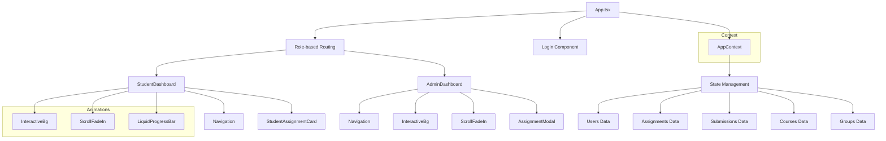
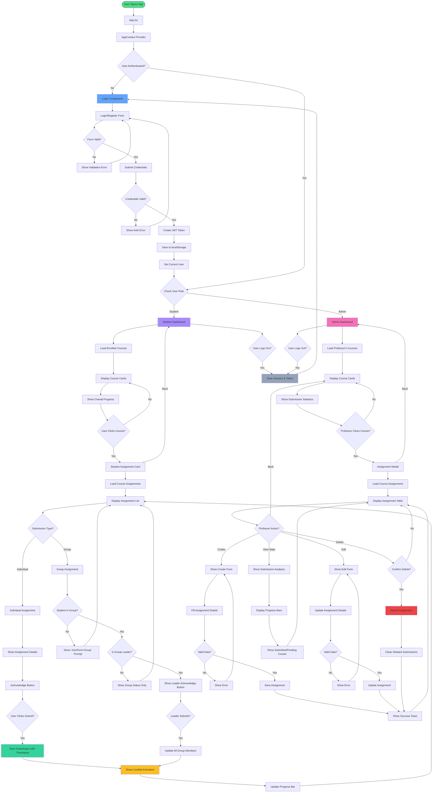
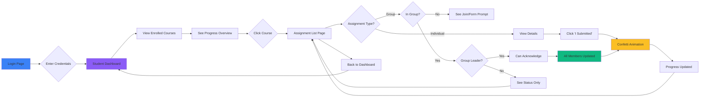
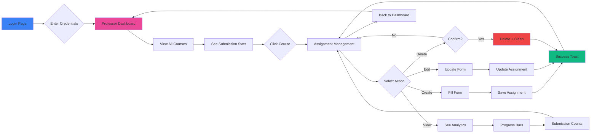

# Assignment Hub - Student & Professor Management System

> **Frontend Enhancement Round 2** - A beautiful, intuitive, and responsive frontend that brings the assignment management system to life.

## Table of Contents

- [Overview](#overview)
- [Setup Instructions](#setup-instructions)
- [Frontend Design Choices](#frontend-design-choices)
- [Component Structure](#component-structure)
- [Technical Stack](#technical-stack)
- [Key Features](#key-features)
- [UI Screenshots](#ui-screenshots)
- [Project Structure](#project-structure)

---

## Overview

A unified platform for professors and students — where students can seamlessly view and submit their assignments, and professors can efficiently track student progress. This frontend enhancement focuses on **UI/UX excellence**, transforming the functional prototype into a beautiful, intuitive, and responsive application.

---

## Setup Instructions

### Prerequisites

Before you begin, ensure you have the following installed:
- **Node.js** (version 16 or higher)
- **npm** or **yarn** package manager

### Installation Steps

1. **Clone the repository**
   ```bash
   git clone <repository-url>
   cd joineasy
   ```

2. **Install dependencies**
   ```bash
   npm install
   # or
   yarn install
   ```

3. **Start the development server**
   ```bash
   npm run dev
   # or
   yarn dev
   ```
   The application will be available at `http://localhost:5173`

4. **Build for production**
   ```bash
   npm run build
   # or
   yarn build
   ```

5. **Preview the production build**
   ```bash
   npm run preview
   # or
   yarn preview
   ```

6. **Run linter**
   ```bash
   npm run lint
   # or
   yarn lint
   ```

### Demo Credentials

To test the application, use the following credentials:

**Student Access:**
- Email: `alice@student.edu`
- Password: `student123`

**Professor Access:**
- Email: `emily@prof.edu`
- Password: `admin123`

---

## Frontend Design Choices

### Architecture Overview

The application follows a **role-based architecture** with clear separation of concerns:

#### 1. Authentication Layer
- **JWT Flow**: Login/Register with token-based authentication
- **Smooth transitions** and form validations
- **Role-based routing** that directs users to appropriate dashboards
- Token expiry validation (24-hour session)
- Automatic session cleanup on expiry

#### 2. State Management
- **React Context API** for global state management
- **localStorage** for data persistence across sessions
- Mock data initialization for demonstration purposes
- Automatic cleanup of orphaned submissions

#### 3. Component Organization
- **Role-specific** component folders (Admin, Student, Login)
- **Reusable UI components** (Navigation, Animation utilities)
- **Modular design** for easy maintenance and scalability
- **Lazy loading** for optimized performance

### Key Design Decisions

#### 1. **Beautiful & Responsive UI**
- **Mobile-first approach** with responsive breakpoints
- **Glassmorphism effects** with backdrop blur
- **Interactive backgrounds** using OGL and custom shaders
- **Smooth animations** with GSAP and Framer Motion
- **Custom scrollbars** for enhanced aesthetics

#### 2. **Role-Based Access Control**
- Conditional rendering based on user roles
- Separate dashboards for students and professors
- Tailored functionality for each user type

#### 3. **Data Persistence**
- localStorage implementation for mock data persistence
- Automatic cleanup of orphaned submissions
- Data initialization with sample assignments and users
- Session management with token validation

#### 4. **UI/UX Enhancements**
- **Interactive spotlight effect** on hover (desktop only)
- **Scroll-based animations** for smooth content transitions
- **Liquid progress bars** for visual appeal
- **Toast notifications** with slide-in/out animations
- **Confetti celebrations** on submission completion
- **Loading states** with suspense boundaries

#### 5. **Component Design Patterns**
- **Reusable card components** for consistent data display
- **Modal patterns** for creation flows
- **Confirmation dialogs** for destructive actions
- **Progress visualization** components (liquid bars, badges)

---

## Component Structure

The application is built with a modular component architecture:

### Component Hierarchy



### Core Components

#### **Authentication**
- `Login.tsx` - Login/Register form with validation

#### **Student Components**
- `StudentDashboard.tsx` - Main dashboard showing enrolled courses
- `StudentAssignmentCard.tsx` - Assignment details and submission logic

#### **Admin/Professor Components**
- `AdminDashboard.tsx` - Course management overview
- `AssignmentModal.tsx` - Create, edit, and manage assignments

#### **Shared Components**
- `Navigation.tsx` - Top navigation bar with user profile

#### **Animation Components**
- `InteractiveBg.tsx` - OGL-based 3D background
- `ScrollFadeIn.tsx` - Intersection observer-based fade animations
- `LiquidProgressBar.tsx` - Animated progress visualization
- `SplitText.tsx` - Text animation utilities
- `confettie.tsx` - Celebration effects
- `NavBar.tsx` - Animated navigation bar
- `FadeContent.tsx` - Content fade transitions
- `orb.tsx` - Floating orb animations

#### **Context**
- `AppContext.tsx` - Global state management with user, assignments, submissions, courses, and groups data

---
## Technical Stack

### Core Technologies
- **React** 19.1.1 - Frontend library for building user interfaces
- **TypeScript** ~5.9.3 - Typed superset of JavaScript for enhanced development experience
- **Vite** 7.1.7 - Fast build tool and development server with hot module replacement

### UI Libraries and Styling
- **Tailwind CSS** 4.1.16 - Utility-first CSS framework for rapid UI development
- **Lucide React** 0.548.0 - Beautiful, consistent icon library
- **GSAP** 3.13.0 - Professional-grade animation library
- **Framer Motion** 12.23.24 - Production-ready motion library for React
- **Canvas Confetti** 1.9.4 - Celebration effects
- **OGL** 1.0.11 - Minimal WebGL library for interactive backgrounds

### State Management & Utilities
- **React Context API** - Built-in state management solution
- **React Intersection Observer** 10.0.0 - Intersection observer hook for scroll animations
- **LocalStorage** - Client-side data persistence

### Development Tools
- **ESLint** 9.36.0 - Code quality and consistency enforcement
- **TypeScript ESLint** 8.45.0 - TypeScript-specific linting rules
- **PostCSS** 8.5.6 - CSS processing and transformation
- **Autoprefixer** 10.4.21 - Vendor prefixing for cross-browser compatibility
- **Babel React Compiler** - React 19 compiler for optimizations

---

## Key Features

### Student Features
- **Course Dashboard** - View all enrolled courses with progress tracking
- **Assignment Viewing** - Detailed assignment information with deadlines
- **Individual Submissions** - Acknowledge individual assignment completion
- **Group Submissions** - Group leader can acknowledge for entire group
- **Progress Tracking** - Visual progress bars and submission statistics
- **Real-time Updates** - Instant UI updates on submission changes

### Professor Features
- **Course Management** - Overview of all taught courses
- **Assignment Creation** - Create assignments with detailed information
- **Assignment Editing** - Modify existing assignments
- **Assignment Deletion** - Remove assignments with confirmation
- **Submission Tracking** - Monitor student/group submission progress
- **Analytics Dashboard** - View submission rates and statistics

### UI/UX Features
- **Responsive Design** - Mobile-friendly interface (320px to 4K)
- **Interactive Animations** - Smooth transitions and hover effects
- **Glassmorphism Effects** - Modern frosted glass aesthetics
- **Interactive Backgrounds** - 3D particle effects
- **Scroll Animations** - Fade-in effects on scroll
- **Loading States** - Suspense boundaries for code splitting
- **Toast Notifications** - Success/error feedback
- **Liquid Progress Bars** - Animated wave effect progress indicators
- **Spotlight Effect** - Interactive glow on hover (desktop)

---

## UI Screenshots

### Login Page

*Clean, modern login interface with smooth form validations*

### Student Dashboard

*Student course overview with progress tracking and interactive cards*

### Professor Dashboard

*Professor course management with submission analytics*


---

## Project Structure

```
joineasy/
├── public/                      # Static assets
├── src/
│   ├── animations/              # Custom animation components
│   │   ├── FadeContent.tsx     # Fade transition animations
│   │   ├── Interactivebg.tsx   # 3D interactive background
│   │   ├── Liquidbar.tsx       # Liquid progress bar component
│   │   ├── NavBar.tsx          # Animated navigation bar
│   │   ├── ScrollFadeIn.tsx    # Scroll-triggered fade animations
│   │   ├── SplitText.tsx       # Text split animations
│   │   ├── confettie.tsx       # Celebration confetti effect
│   │   └── orb.tsx             # Floating orb animations
│   │
│   ├── components/              # React components organized by role
│   │   ├── Admin/              # Professor/Instructor components
│   │   │   ├── AdminDashboard.tsx      # Professor main dashboard
│   │   │   └── AssignmentModal.tsx     # Assignment CRUD modal
│   │   │
│   │   ├── Login/              # Authentication components
│   │   │   └── Login.tsx       # Login/Register form
│   │   │
│   │   ├── Navigationbar/      # Navigation components
│   │   │   └── Navigation.tsx  # Top navigation bar
│   │   │
│   │   └── Student/            # Student components
│   │       ├── StudentAssignmentCard.tsx  # Assignment details card
│   │       └── StudentDashboard.tsx       # Student main dashboard
│   │
│   ├── context/                 # Application state management
│   │   └── AppContext.tsx      # Global state with Context API
│   │
│   ├── App.css                  # Global styles
│   ├── App.tsx                  # Main application component and routing
│   ├── index.css                # Base styles and Tailwind directives
│   └── main.tsx                 # Application entry point
│
├── index.html                   # HTML template
├── package.json                 # Dependencies and npm scripts
├── package-lock.json            # Dependency lock file
├── tsconfig.json                # TypeScript configuration
├── tsconfig.app.json            # TypeScript app-specific config
├── tsconfig.node.json           # TypeScript Node.js config
├── vite.config.ts               # Vite build configuration
├── eslint.config.js             # ESLint configuration
└── README.md                    # This file
```

---

## Workflow Diagrams

### Complete Application Flow



### Student User Journey



### Professor User Journey



**Built with using React, TypeScript, and Tailwind CSS**
